= Preface

В данном руководстве мы рассмотрим основы фреймворка Jmix, и разработаем простое, но полнофункциональное приложение для управления проектами. Мы пройдем через все этапы создания веб-приложений:

* проектирование модели данных;
* манипуляции с данными;
* создание сервисов для выполнения бизнес-логики;
* создание ролей и разграничение прав доступа;
* разработка пользовательского интерфейса.

В целом, полученных знаний будет достаточно для того, чтобы начать создавать свои собственные приложения с использованием фреймворка Jmix. В процессе мы будем использовать среду разработки https://www.jmix.io/tools/[Jmix Studio^]. Пожалуйста, установите её на свой компьютер и активируйте лицензию для работы с визуальными дизайнерами.

Репозиторий с готовым проектом: https://github.com/Haulmont/jmix-quickstart.

1:05 Создание проекта

Используя меню IntelliJ IDEA, создадим пустой проект Jmix. Будем использовать Java 11.

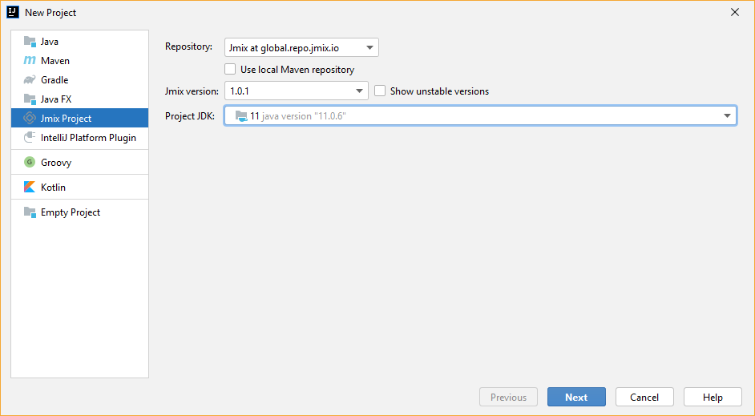

Сгенерируем код проекта на основе шаблона `single-module-application`.

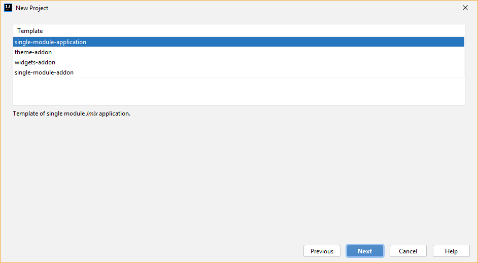

Укажем имя проекта - `jmix-pm`. 

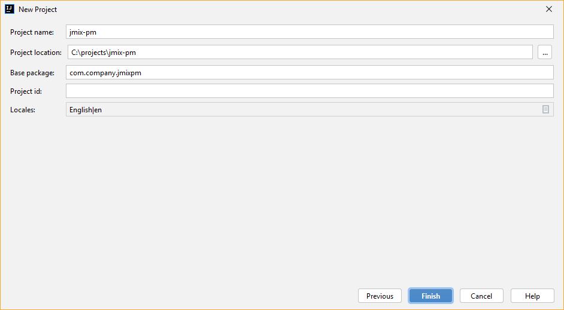

После создания проекта с помощью окна инструментов *Jmix* вы сможете просматривать и редактировать файлы проекта, управлять настройками, а также добавлять объекты в проект.

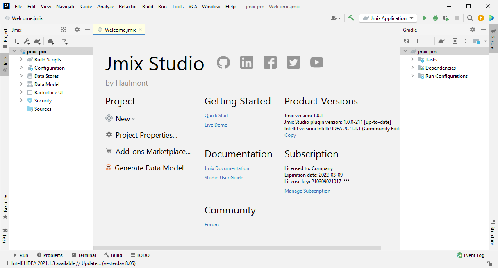

2:45 Создание модели данных и базы данных

Первый этап - создание сущностей модели данных. В нашей модели будет только два класса: Проект (Project) и Задача (Task), связанные отношением один-ко-многим, т.е. каждый проект может содержать несколько задач.

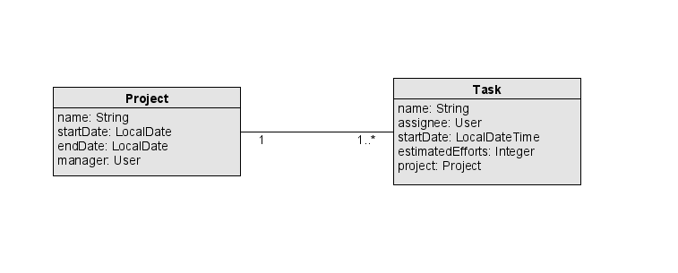

Для начала создадим сущность Проект. Дизайнер сущности можно вызвать через ссылку на начальной странице проекта в IDE.

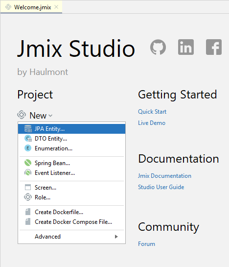

Второй способ - кликнуть правой кнопкой мыши на узле *Data Model* в окне инструментов *Jmix* и выбрать в меню *New -> JPA Entity*.

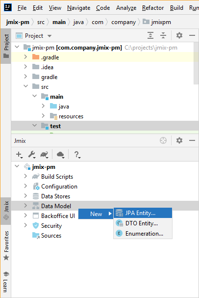

Введите название сущности - `Project`. Другие параметры сущности оставим без изменений.

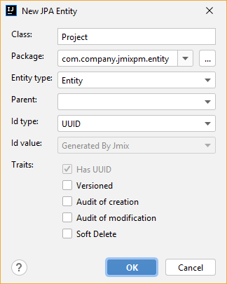

В дизайнере сущности создадим атрибуты в соответствии с таблицей ниже:

|===
|*Название* |*Тип* |*Обязательный*
|name|String (255)|Да
|startDate|LocalDate|
|endDate|LocalDate|
|manager|Связь с сущностью "User", тип связи - ассоциация, многие к одному|Да
|===

В Jmix для сущностей мы используем обычные классы с JPA-аннотациями. Их можно изменять как в редакторе кода, так и в визуальном дизайнере. Кликните по кнопке со значком “+” и добавьте атрибуты в сущность. Jmix Studio сгенерирует необходимые аттрибуты и расставит аннотации.

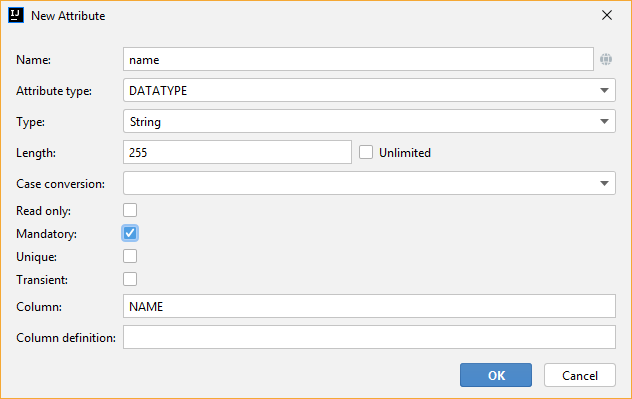

Посмотрим, как добавить обязательный аттрибут `manager` ссылочного типа. Это отношение - многие-к-одному, так что сделаем поле-ассоциацию. В итоге определение атрибута `manager` в визуальном дизайнере выглядит так:

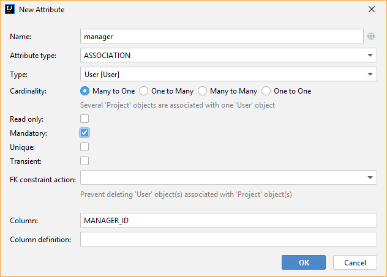

В Jmix мы можем задать формат текстового отображения сущностей в пользовательском интерфейсе - имя экземпляра. Для проекта выберем поле "Имя".

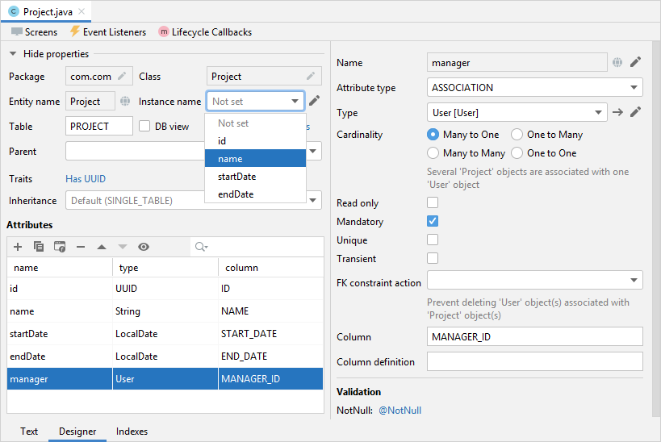

Если посмотрим на Java-код в дизайнере сущности, то увидим, что создали обычный класс с JPA-аннотациями. При необходимости, этот код можно исправить в текстовом редакторе, визуальный редактор отобразит эти изменения.

Давайте продолжим и создадим сущность Задача и свяжем ее с сущностью Проект. Спецификация атрибутов представлена в таблице ниже.

|===
|*Имя* |*Тип* |*Обязательный*
|name|String (255)|Да
|assignee|Связь с сущностью "User", тип связи - ассоциация, многие к одному|Да
|startDate|LocalDateTime|
|estimatedEfforts|Integer|
|===

Задача не может существовать без проекта. В Jmix такой тип связи называется композиция. Создадим связь между задачей и проектом. Откроем сущность Проект и создадим аттрибут - `tasks` - список задач в проекте. 

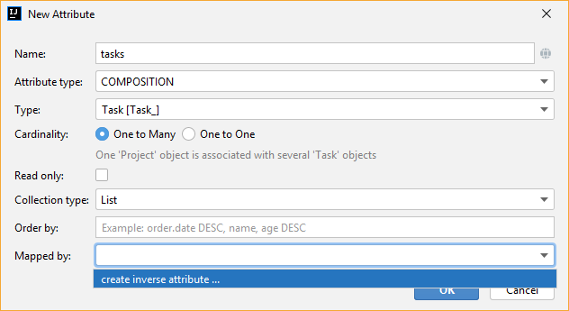

Чтобы связать Проект с сущностью Задача, создадим обратный атрибут в задаче.

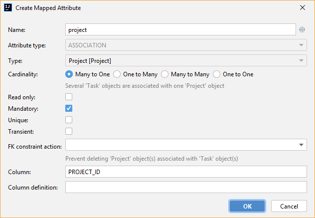

Наша модель данных готова. Давайте сгенерируем скрипты базы данных. 

Раскройте узел *Data Stores* в окне инструментов *Jmix* и кликните *Main Data Store* правой кнопкой мыши. В контекстном меню выберите *Generate Liquibase Changelog*.

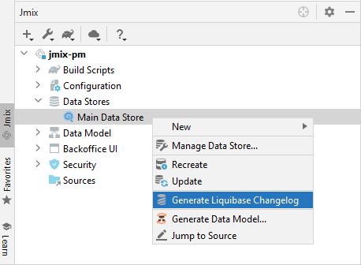

Jmix Studio сравнивает существующую схему базы данных с моделью данных приложения и генерирует скрипты базы данных.

В нашем проекте мы используем базу данных HSQLDB.

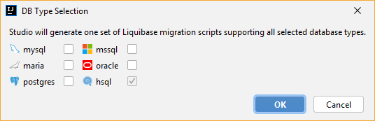

Студия может попросить вас применить существующие скрипты базы данных.

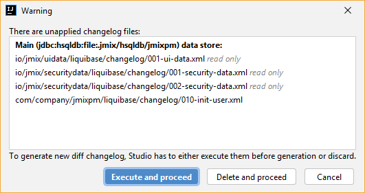
 
Вот и все, мы создали базу данных.

5:27 Создание стандартных экранов

В Jmix Studio есть генератор пользовательского интерфейса. С его помощью мы создадим простые, но полезные экраны:

* Браузер - для просмотра данных в табличной форме.
* Редактор - для редактирования одной строки данных.

Сначала создадим экраны для работы с проектами. Запустите генератор, кликнув на пункте *Create screen* в меню *Screens* в верхней части дизайнера сущностей.

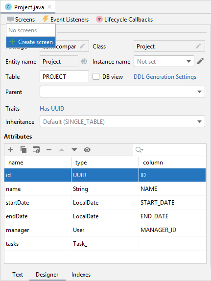

Также вы можете использовать окно инструментов *Jmix*. Кликните кнопку *+* и выберите *Screen* из списка.

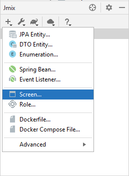

Выберите *Entity browser and editor screens* в мастере создания экранов.

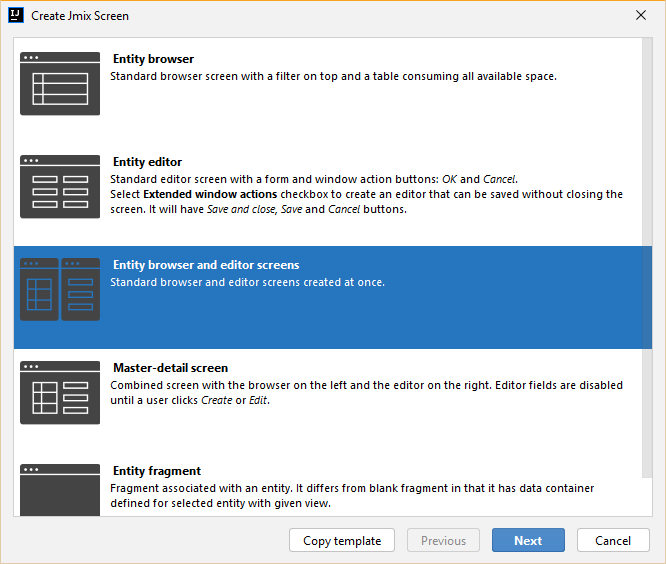

Нажмите *Next* и остановитесь на шаге *Entity browser fetch plan*.

В Jmix мы можем определять несколько планов выборки для каждой сущности. План выборки определяет, значения каких полей будут извлекаться из базы данных. Создавать планы выборки можно в отдельных файлах, чтобы затем использовать в разных модулях приложения, либо прямо при создании экрана.

Определим план выборки на этапе создания экрана. В дополнение к выбранным атрибутам добавим ссылку на менеджера.

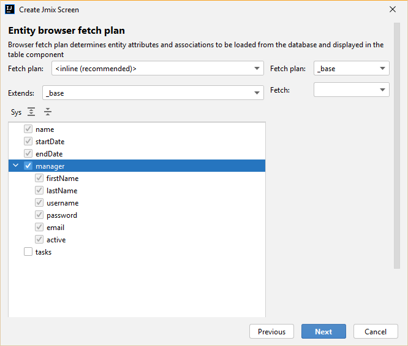

На следующем шаге выберем ссылку на менеджера и поле с задачами.

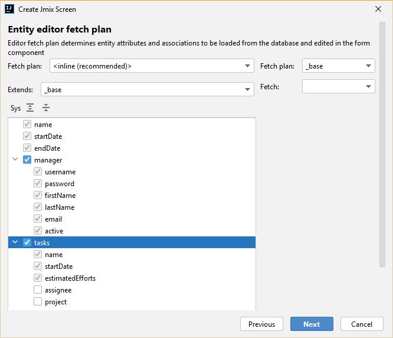

Нажмите *Next* на следующем шаге и завершите создание экранов.

Видим, что каждый экран состоит из двух частей: контроллера, написанного на языке Java, который отвечает за логику работы экрана, и разметки в формате XML, которая отвечает за внешний вид и расположение элементов экрана. В нашем случае, браузер состоит из файлов `ProjectBrowse.java` и `project-browse.xml`, а редактор - из `ProjectEdit.java` и `project-edit.xml` соответственно.

XML-дескрипторы вы можете найти под узлом *Data Model* в окне инструментов *Jmix*.

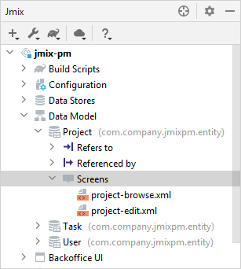

Чтобы открыть контроллер, используйте контекстное меню.

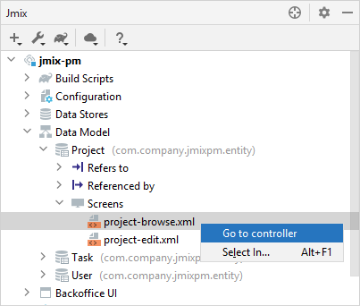

Отметьте для себя раздел `data` в XML-дескрипторе - он определяет, как данные выбираются из базы данных.

[source,xml]
----
<data readOnly="true">
    <collection id="projectsDc"
                class="com.company.jmixpm.entity.Project">
        <fetchPlan extends="_base">
            <property name="manager" fetchPlan="_base"/>
        </fetchPlan>
        <loader id="projectsDl">
            <query>
                <![CDATA[select e from Project e]]>
            </query>
        </loader>
    </collection>
</data>
----

Когда экраны созданы, вы можете использовать кнопки в верхнем правом углу редактора экрана для переключения режимов предпросмотра. При предпросмотре видим, что все выбранные атрибуты добавлены в экраны.

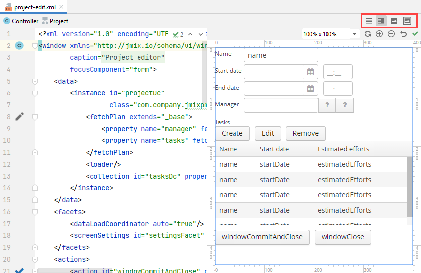

Компоненты пользовательского интерфейса могут быть привязаны к данным. Все изменения в связанных полях отражаются в выбранных данных и наоборот.

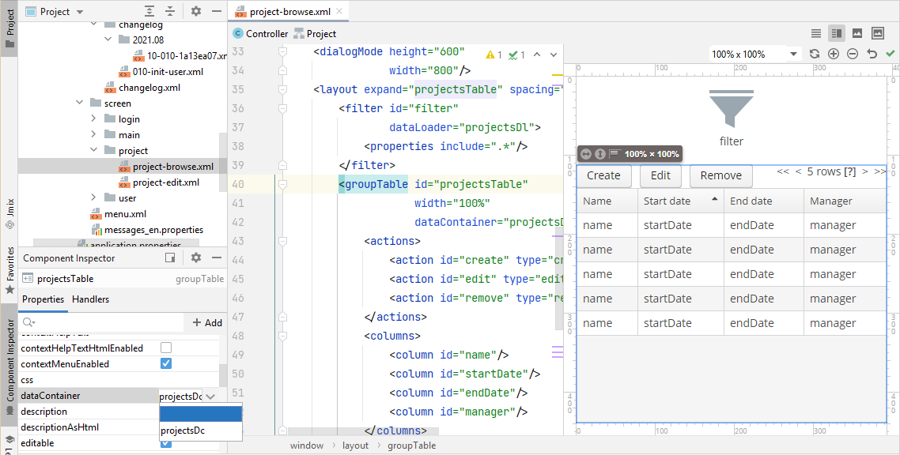

Теперь сгенерируем экраны для сущности Задача. Выберем также ссылки на исполнителя задачи и проект. 

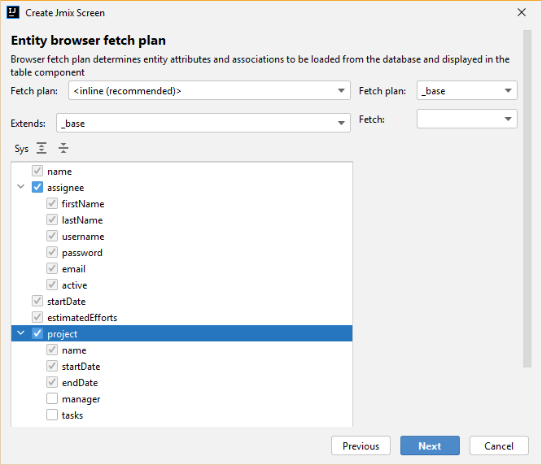

На следующем шаге все поля уже выбраны.

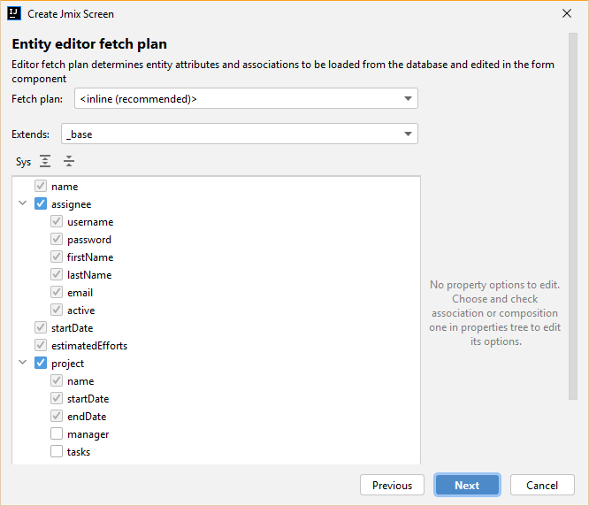

Между контроллером, разметкой и ассоциированной сущностью можно быстро переключаться, используя кнопки навигации в верхней части окна.

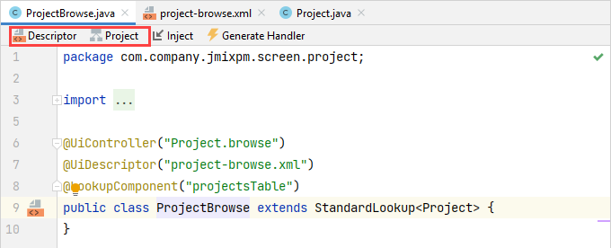

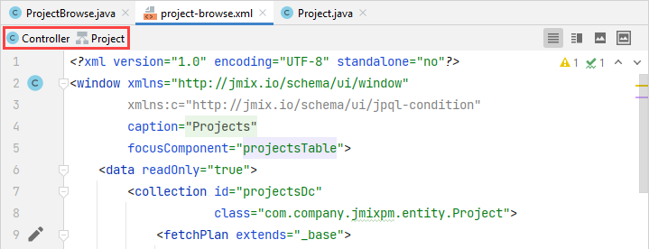

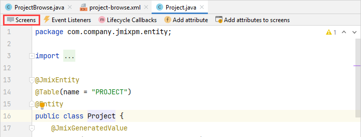

7:25 Первый запуск

Чтобы запустить приложение, можно воспользоваться кнопкой на панели инструментов IDE.

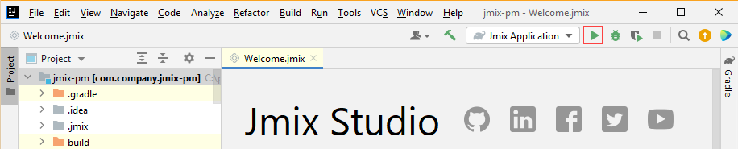

После старта сервера приложение можно открыть в веб-браузере, используя URL, который показан в окне запуска. В нашем случае, это будет http://localhost:8080/app. 

В окне *Run* вы может просматривать лог-файл приложения.

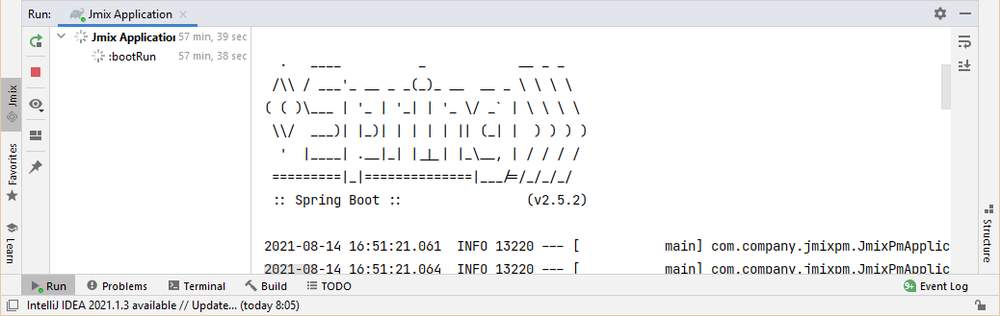

После открытия будет выведено окно логина, имя пользователя - admin, пароль - admin.

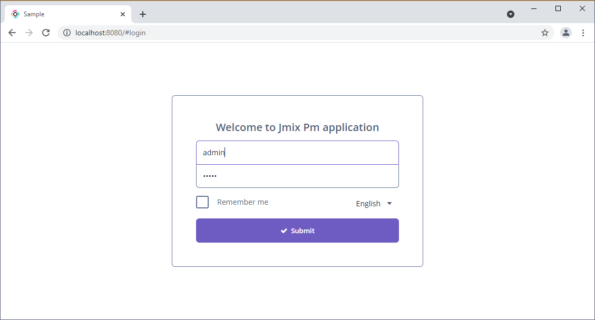

Экраны приложения можно открыть из меню *Application*.

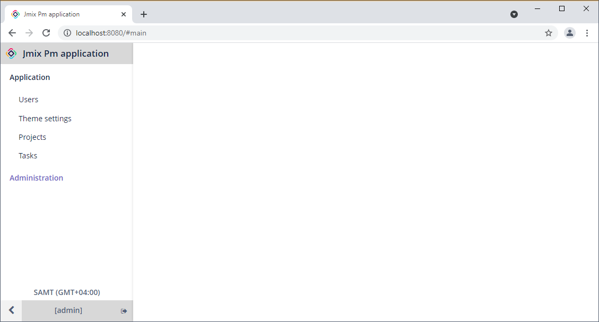

Давайте добавим тестовые данные. Создадим проект и выберем администратора в качестве менеджера. 

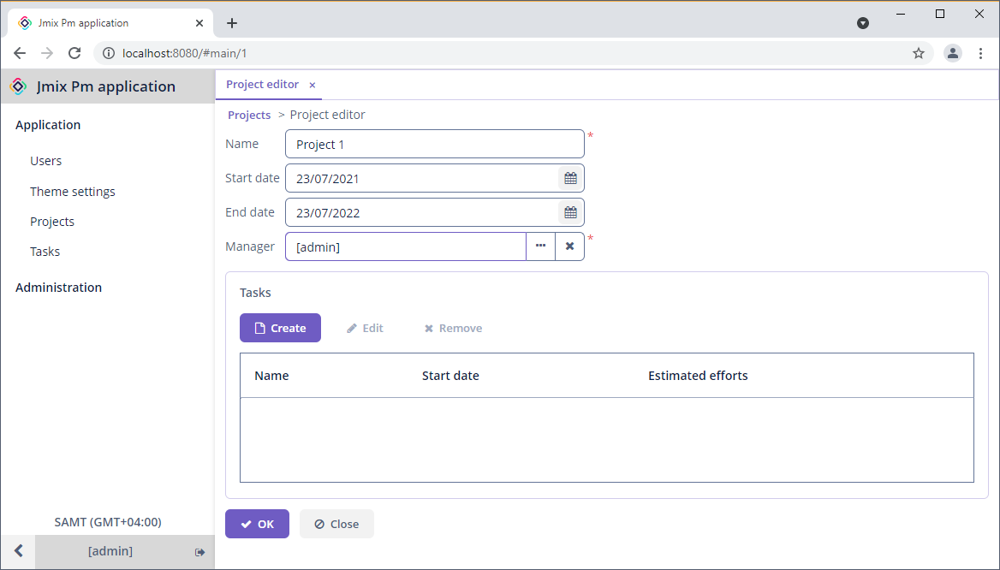

Мы можем добавлять задачи на этапе создания проекта.

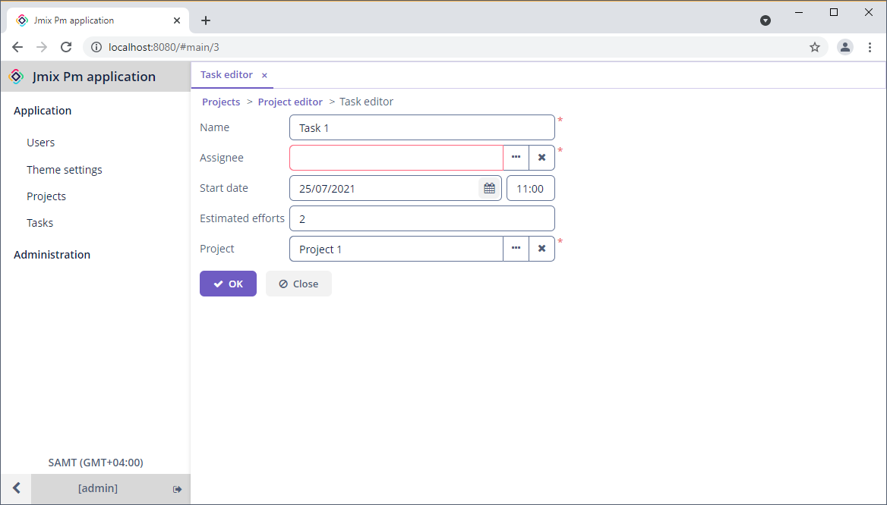

Добавим нового пользователя - `dev1` - он будет исполнителем задачи. 

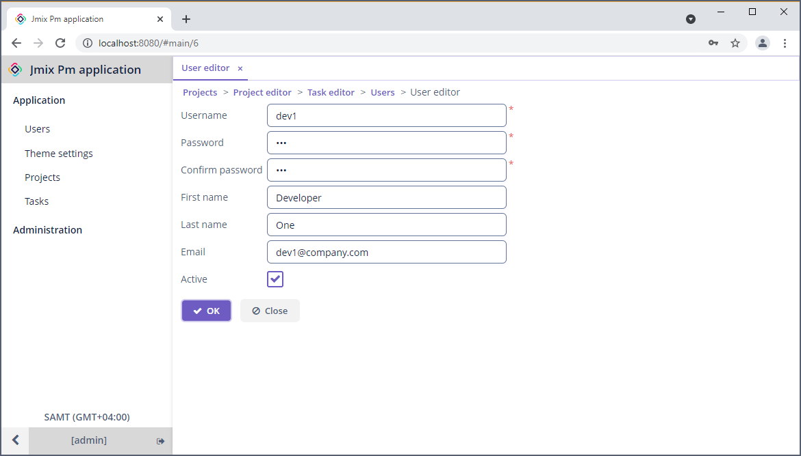

Сохраним проект, задача будет сохранена автоматически.

8:25 Настройка прав доступа

В Jmix можно создавать роли и выдавать разрешения для доступа к данным приложения - сущностям и атрибутам, а также элементам пользовательского интерфейса - экранам и пунктам меню.

Откройте экран *Resource roles* и создайте роль для разработчика - "Developer". Выберите *Entity policy* из списка и разрешите разработчику просматривать и редактировать задачи.

image:images/entity-policy-menu.png[align="center"]

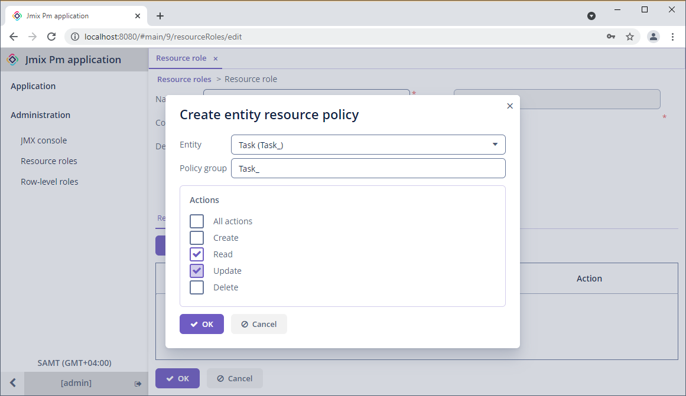

Затем разрешите разработчику редактировать оценку задачи и дату начала выполнения. 

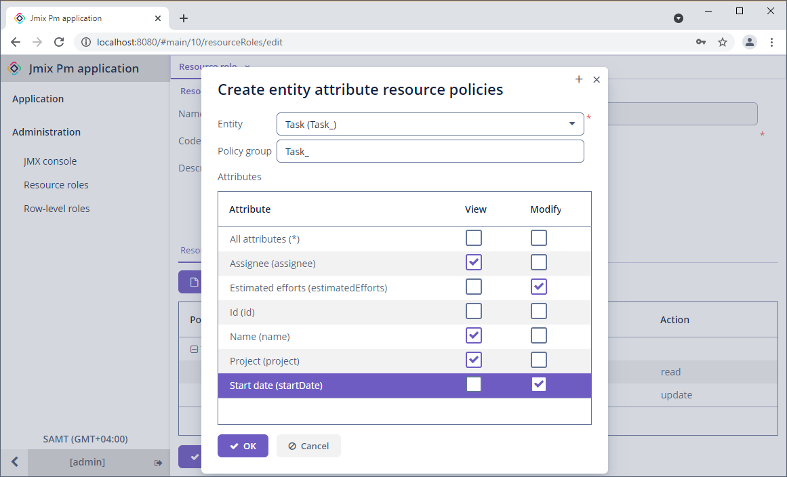

Далее выдайте разрешения на доступ к экранам просмотра и редактирования. Выберите *Grant access to the menu item*, чтобы в меню приложения отображался элемент *Tasks*.

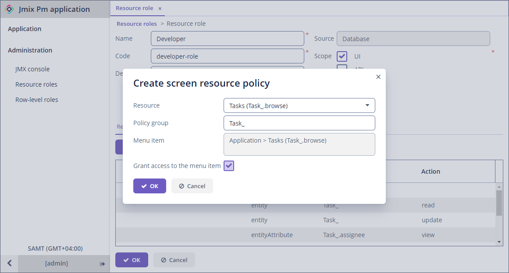

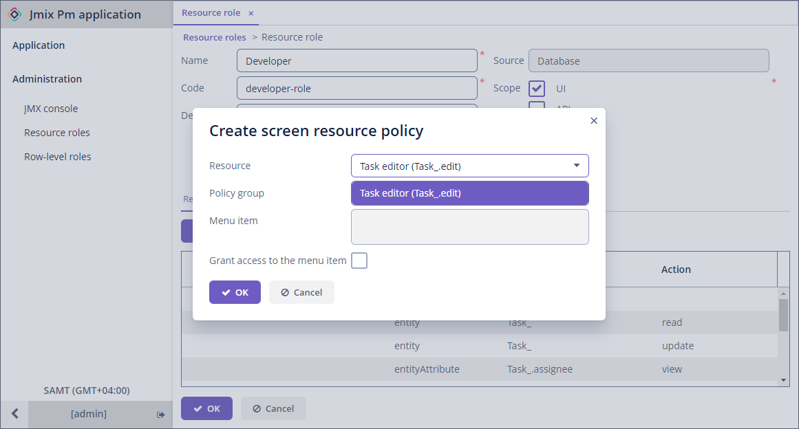

Перейдите на вкладку *Child roles* и добавьте роль "UI: minimal access", которая разрешает пользователям авторизоваться в приложении.

image:images/minimal-role.png[align="center"]

Теперь назначим роль "Developer" пользователю "dev1". Выберите *Role assignments* в экране *Users*.

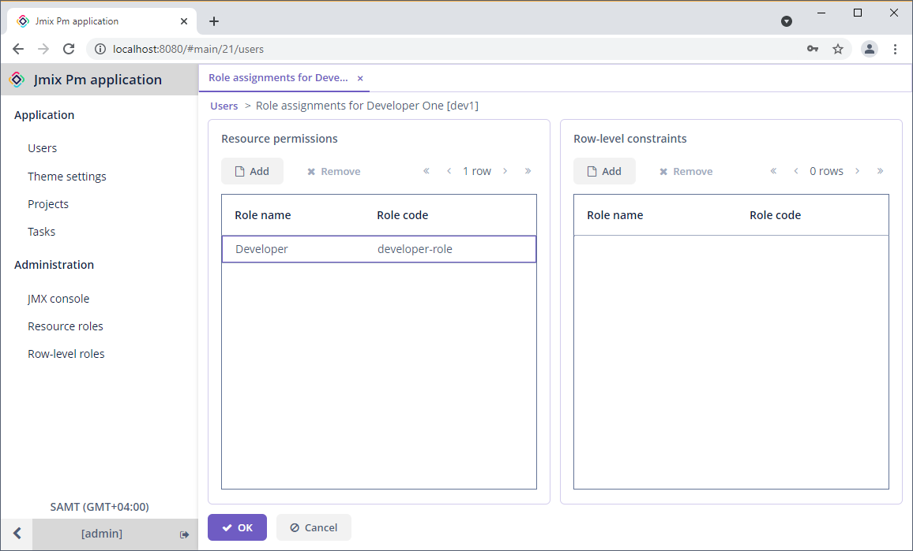

Давайте авторизуемся под пользователем "dev1". Видим, что у пользователя есть доступ только к разрешенным экранам и атрибутам.

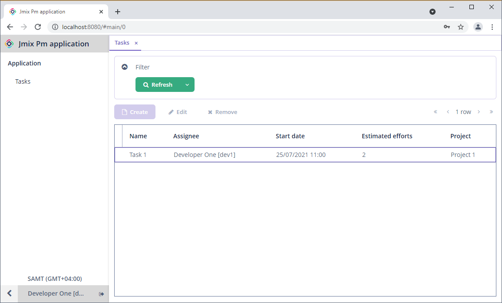 

9:38 Добавление бизнес-логики

С помощью Jmix Studio создадим сервис, который будет реализовать бизнес-логику, и подключим его к экрану. Это будет сервис, возвращающий пользователя с наименьшим количеством задач. Будем использовать это сервис в пользовательском интерфейсе для автоматического назначения исполнителя.

Используйте меню в окне инструментов *Jmix*, чтобы открыть список действий. Выберите *Spring Bean* и введите имя сервиса - `TaskService`.

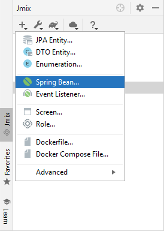

Студия сгенерирует пустой Spring-бин. Замените аннотацию `@Component` на `@Service`.

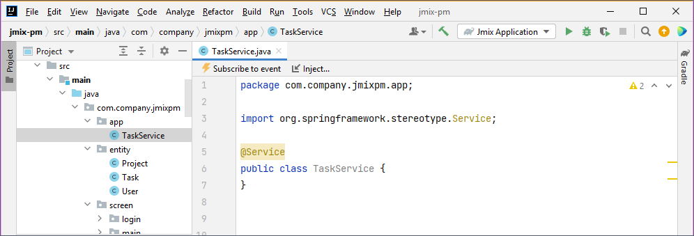

Создадим метод `findLeastBusyUser()`. В нашем сервисе будем использовать Jmix-сервис - `DataManager`. Он позволяет получить доступ к данным с помощью JPQL-запроса.

Добавим `DataManager` в наш сервис с помощью кнопки *Inject* в верхней части окна.

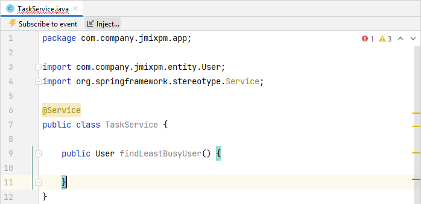

В появившемся окне найдите `DataManager`.

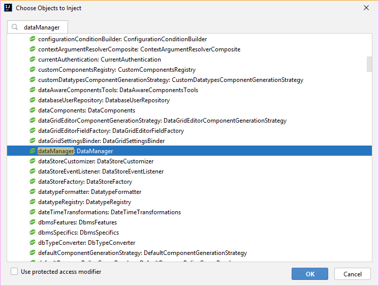

Итоговый код метода представлен ниже:

[source,java]
----
@Service
public class TaskService { 

    @Autowired
    private DataManager dataManager;

    public User findLeastBusyUser() {
        User leastBusyUser = dataManager.loadValues("select u, count(t.id) " + // <1>
                "from User u left outer join Task_ t " +
                "on u = t.assignee " +
                "group by u order by count(t.id)")
                .properties("user", "tasks")
                .list().stream().map(e -> e.<User>getValue("user"))
                .findFirst() // <2>
                .orElseThrow(IllegalStateException::new);
        return leastBusyUser; // <3>
    }
}
----
<1> JPQL-запрос, который выбирает пользователей и считает сколько на них назначено задач.
<2> Берем первого пользователя из результата запроса.
<3> Возвращаем пользователя.

Сервис готов, давайте воспользуемся им в экране редактирования задачи. 

Кликните кнопку *Generate Handler* в верхней части окна выберите событие `InitEntity`.

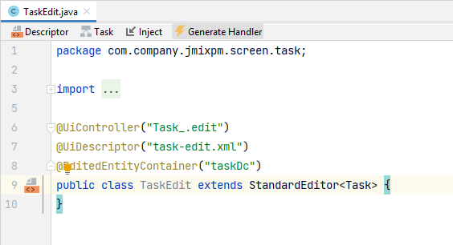

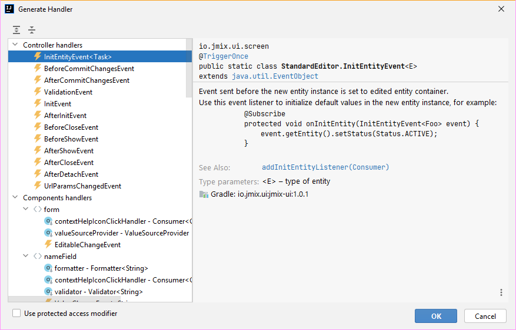

Ниже представлена реализация метода:

[source,java]
----
public class TaskEdit extends StandardEditor<Task> {
    @Autowired
    private TaskService taskService; // <1>

    @Subscribe
    public void onInitEntity(InitEntityEvent<Task> event) {
        event.getEntity().setAssignee(taskService.findLeastBusyUser()); // <2>
    }
}
----
<1> Добавляем сервис `TaskService` в экран.
<2> Результат работы метода записываем в поле `assignee` созданной задачи.

Всё готово. Перезапустим приложение и посмотрим на работу сервиса.

Сначала добавим еще одного разработчика - `dev2`.

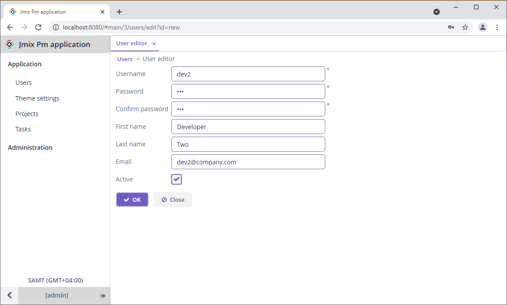

Сейчас у нас есть только одна задача, назначенная на разработчика "dev 1", поэтому следующую задачу получит либо пользователь "admin", либо "dev2".

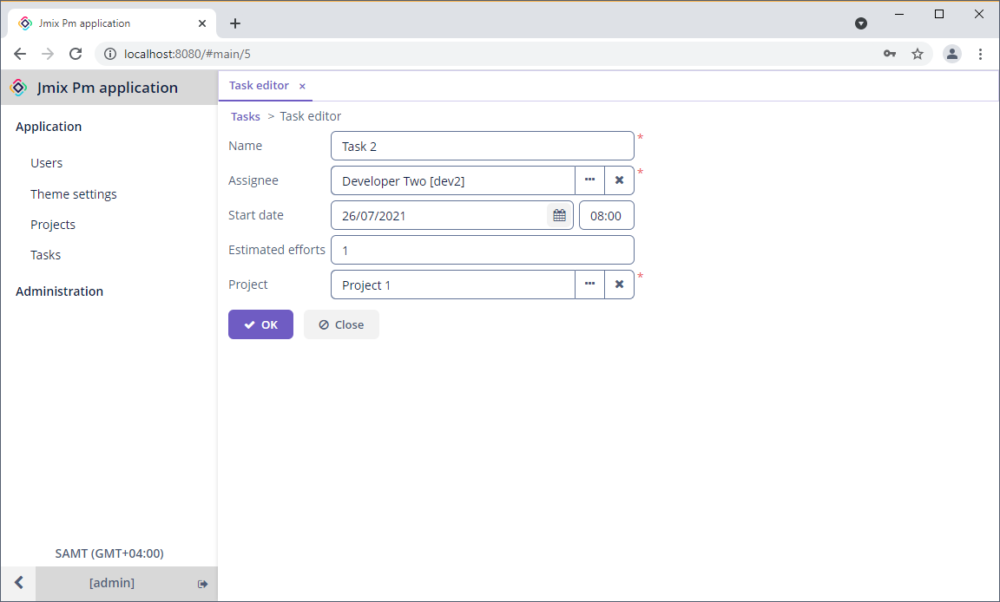

После того, как мы добавили четыре задачи, следующая задача будет назначена либо на пользователя "admin", либо "dev1", потому что у каждого из них по одной задаче.

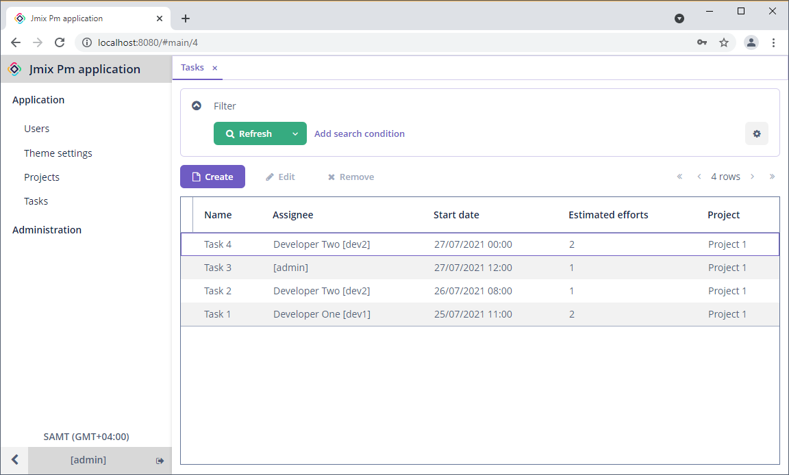

11:45 Развертывание

Помотрим, как развернуть приложение Jmix c помощью выполняемого JAR-файла.

Сначала запустите команду `boot:jar` в Jmix Studio. 

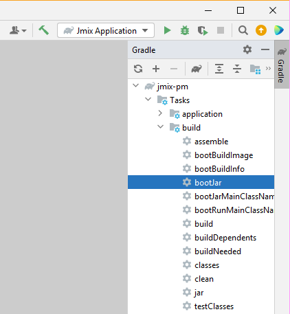

Файл готов, перейдите в папку с файлом.

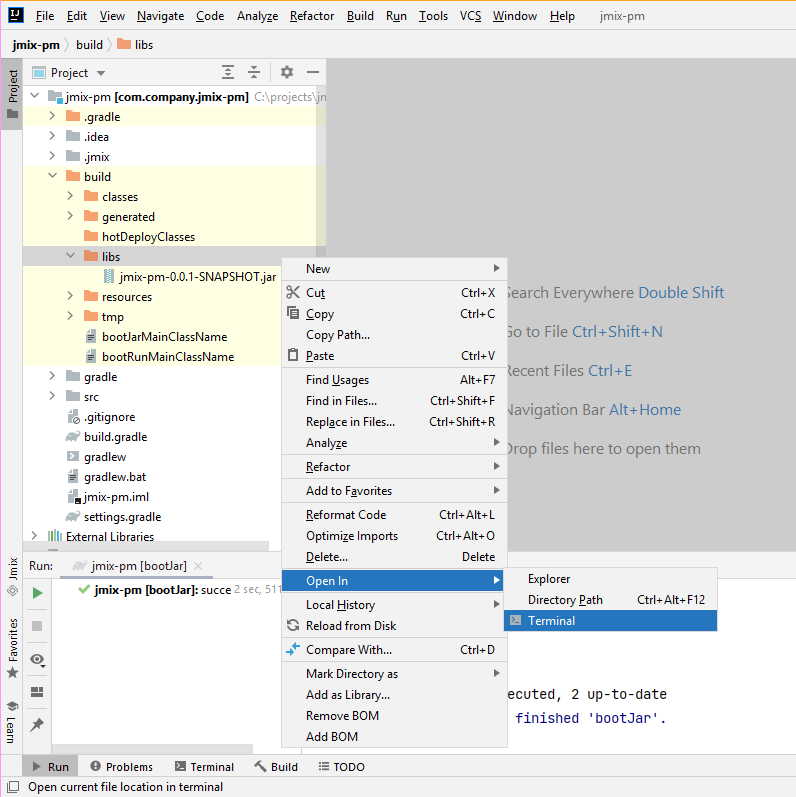

Затем выполните команду `java -jar <file_name>`. 

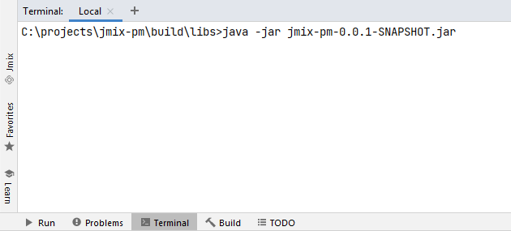

Теперь можно перейти в браузер и посмотреть на запущенное приложение.

12:26 Заключение

С помощью Jmix вы можете разработать готовое к развертыванию приложение на Spring Boot за несколько минут благодаря мощным инструментам разработки и генераторам кода. Спасибо за интерес к Jmix!